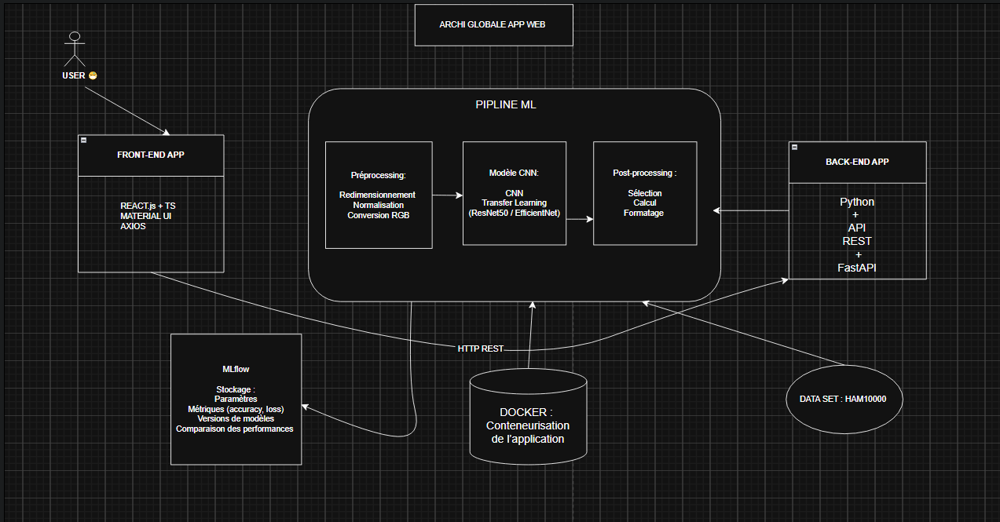

# image-dataset-analysis
# Titre du projet : Classfication des images médicales 

## Objectif
Décrire brièvement l’objectif du projet: une application web basée sur un modèle CNN capable de classifier automatiquement des images de lésions cutanées pour distinguer différents types de cancer de la peau (et lésions bénignes) à partir du dataset HAM10000

## Dataset
- Nom du dataset : Skin Cancer MNIST: HAM10000
- Lien du dataset : https://www.kaggle.com/datasets/kmader/skin-cancer-mnist-ham10000

## Équipe
- OUERFELLI Oumaima

## Exploration du dataset
Cette section présente une analyse descriptive du dataset d’images.

### Nombre d’images par classe
(Ajouter un tableau + graphique)

### Observations
(Ajouter quelques phrases d’analyse)

## Architecture du projet
- Données : images
- Backend : Python / FastAPI
- API REST
- Visualisation : Dashboard
  

